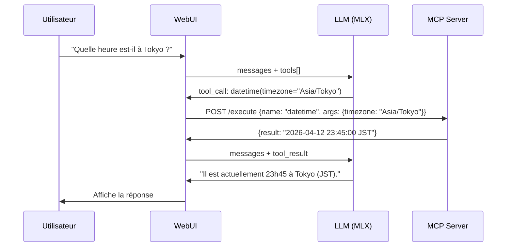

# 🔧 Mirza MCP — Micro Serveur Model Context Protocol

Roadmap pour développer un micro-serveur MCP (Model Context Protocol) qui donne des **outils** au modèle LLM, exécutable soit sur le Mac (Mirza), soit sur la machine cliente.

---

## Qu'est-ce que MCP ?

Le **Model Context Protocol** (Anthropic, open standard) permet à un LLM d'appeler des **outils** (fonctions) pour interagir avec le monde réel : lire des fichiers, chercher sur le web, faire des calculs, exécuter du code, etc.

```
┌──────────┐    ┌──────────────┐    ┌─────────────┐
│ WebUI    │───▶│ LLM Server   │───▶│ MCP Server  │
│ (client) │    │ (MLX / Cloud)│    │ (tools)     │
└──────────┘    └──────────────┘    └─────────────┘
                       │                    │
                  API OpenAI          Tool calls
                  /v1/chat/           (fonctions)
                  completions
```

L'idée : le LLM reçoit la liste des outils disponibles, décide quand les utiliser, et renvoie les résultats dans la conversation.

---

## Architecture Proposée

### Option A — Serveur MCP sur le Mac (Mirza)
- ✅ Accès direct au filesystem du serveur
- ✅ Pas de latence réseau pour les tool calls
- ✅ Peut monitorer les processus locaux
- ❌ Nécessite un port ouvert supplémentaire sur le Mac

### Option B — Serveur MCP sur la machine cliente
- ✅ Accès aux fichiers de l'utilisateur
- ✅ Peut utiliser des outils locaux (navigateur, etc.)
- ✅ Pas de dépendance au Mac pour les outils
- ❌ Latence si le LLM tourne sur le Mac

### Option C — Hybride (recommandé)
- Un MCP léger sur le Mac pour les outils système
- Un MCP sur le client pour les outils utilisateur
- La WebUI agrège les deux

---

## Stack Technique

| Composant | Choix | Justification |
|---|---|---|
| **Langage** | Python | Cohérent avec l'écosystème MLX + uv |
| **Framework** | FastAPI | API HTTP rapide, async, OpenAPI auto-doc |
| **Package manager** | uv | Cohérent avec le reste du projet |
| **Transport** | HTTP + SSE | Compatible avec le standard MCP |
| **Standard** | MCP Protocol | Interopérable avec Claude, ChatGPT, etc. |

---

## Phase 1 — Fondation (MVP)

### Objectif
Un serveur HTTP minimal avec 3 outils de base, compatible avec le format OpenAI `tools`.

### Fichiers 
```
mirzaServer/mcp/
├── pyproject.toml          # Projet uv
├── server.py               # Serveur FastAPI principal
├── tools/
│   ├── __init__.py
│   ├── base.py             # Classe abstraite Tool
│   ├── calculator.py       # Outil: évaluation d'expressions math
│   ├── datetime_tool.py    # Outil: date/heure courante + timezone
│   └── system_info.py      # Outil: infos système du Mac
└── setup_mcp.sh            # Script d'installation
```

### API Endpoints

| Endpoint | Méthode | Description |
|---|---|---|
| `GET /tools` | GET | Liste les outils disponibles (format MCP) |
| `POST /execute` | POST | Exécute un outil par nom avec arguments |
| `GET /health` | GET | Health check |

### Format de réponse `/tools`
```json
{
  "tools": [
    {
      "name": "calculator",
      "description": "Évalue une expression mathématique",
      "inputSchema": {
        "type": "object",
        "properties": {
          "expression": { "type": "string", "description": "Expression math (ex: 2+2, sqrt(16))" }
        },
        "required": ["expression"]
      }
    }
  ]
}
```

### Format de requête `/execute`
```json
{
  "name": "calculator",
  "arguments": { "expression": "sqrt(144) + 3**2" }
}
```

### Format de réponse `/execute`
```json
{
  "result": "21.0",
  "tool": "calculator",
  "execution_time_ms": 2
}
```

---

## Phase 2 — Outils Avancés

### Outils Fichiers (sur le Mac)
| Outil | Description |
|---|---|
| `read_file` | Lire le contenu d'un fichier |
| `write_file` | Écrire dans un fichier |
| `list_directory` | Lister le contenu d'un répertoire |
| `search_files` | Rechercher dans les fichiers (grep) |

### Outils Web
| Outil | Description |
|---|---|
| `web_search` | Recherche web (via DuckDuckGo API, pas de clé) |
| `fetch_url` | Récupérer le contenu d'une URL |
| `web_screenshot` | Screenshot d'une page web |

### Outils Système (spécifiques Mac)
| Outil | Description |
|---|---|
| `run_command` | Exécuter une commande shell (sandbox) |
| `system_monitor` | Métriques CPU/GPU/RAM en temps réel |
| `process_list` | Lister les processus actifs |

### Outil Code
| Outil | Description |
|---|---|
| `python_eval` | Exécuter du code Python dans un sandbox |
| `git_status` | Statut git d'un repo |

---

## Phase 3 — Intégration WebUI

### Flux complet avec tool use



### Modifications WebUI nécessaires
1. **Boucle de tool call** — quand le LLM répond avec un `tool_calls`, la WebUI exécute l'outil via le serveur MCP, puis renvoie le résultat au LLM
2. **Affichage des tool calls** — montrer visuellement quand un outil est appelé (icône, nom, arguments)
3. **Sandboxing** — certains outils (run_command, write_file) nécessitent une confirmation utilisateur

---

## Phase 4 — Plugins & Extensibilité

### Système de plugins
```python
# tools/my_custom_tool.py
from tools.base import Tool

class MyTool(Tool):
    name = "my_tool"
    description = "Description de mon outil personnalisé"
    input_schema = {
        "type": "object",
        "properties": {
            "param1": {"type": "string", "description": "..."}
        }
    }

    async def execute(self, arguments: dict) -> str:
        # Logique de l'outil
        return f"Résultat: {arguments['param1']}"
```

### Auto-discovery
Le serveur scanne automatiquement le dossier `tools/` et charge tous les fichiers Python qui héritent de `Tool`.

### Registry distant
Possibilité de charger des outils depuis un registre distant (GitHub, npm-style) pour partager des outils entre stations Mirza.

---

## Phase 5 — Sécurité & Production

| Aspect | Mesure |
|---|---|
| **Sandboxing** | Les outils filesystem et shell sont limités à des répertoires autorisés |
| **Rate limiting** | Max N appels/minute par outil |
| **Confirmation** | Les outils destructifs (écriture, exécution) demandent une confirmation dans la WebUI |
| **Logging** | Chaque appel d'outil est loggé avec timestamp, arguments, résultat |
| **Auth** | Token d'authentification pour le serveur MCP |

---

## Priorité & Effort estimé

| Phase | Effort | Priorité |
|---|---|---|
| Phase 1 — MVP (3 outils) | ~1 jour | 🔴 Haute |
| Phase 2 — Outils avancés | ~2 jours | 🟡 Moyenne |
| Phase 3 — Intégration WebUI | ~1 jour | 🔴 Haute |
| Phase 4 — Plugins | ~1 jour | 🟢 Basse |
| Phase 5 — Sécurité | ~1 jour | 🟡 Moyenne |

---

## Pour commencer

```bash
# Sur le Mac (via SSH)
cd mirzaServer/mcp/
uv init --name mirza-mcp --python ">=3.12"
uv add fastapi uvicorn
uv run uvicorn server:app --host 0.0.0.0 --port 3001

# Dans la WebUI → Paramètres → Outils (MCP)
# Endpoint: http://mirza.local:3001
# → "Rafraîchir les outils"
```
