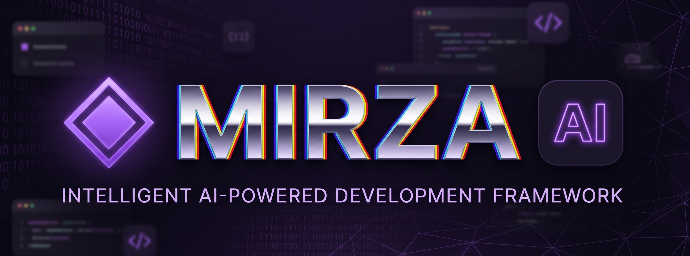
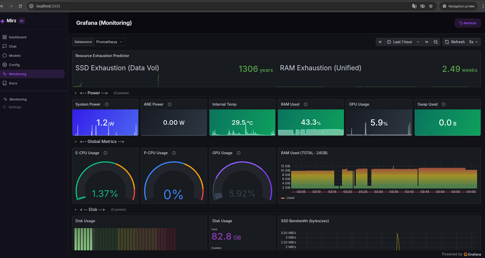
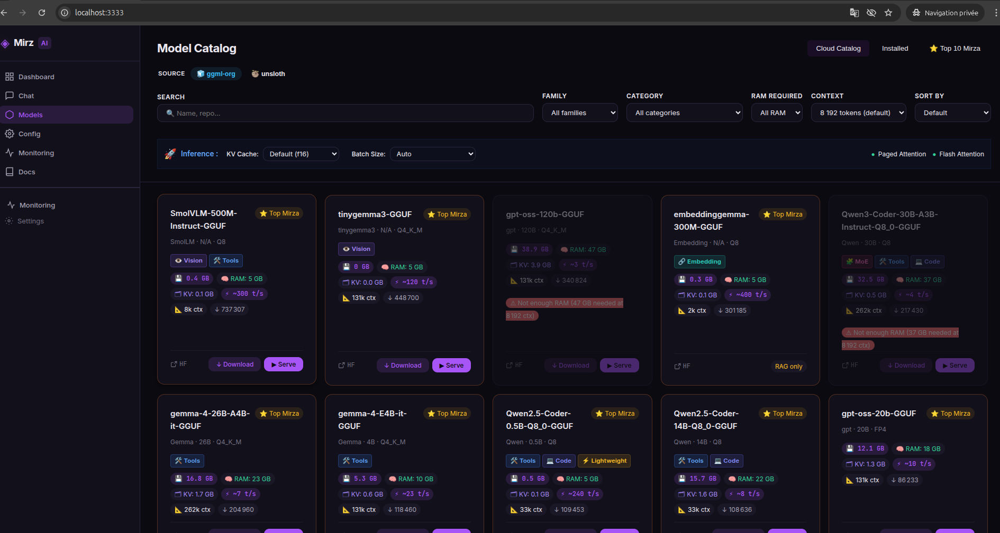
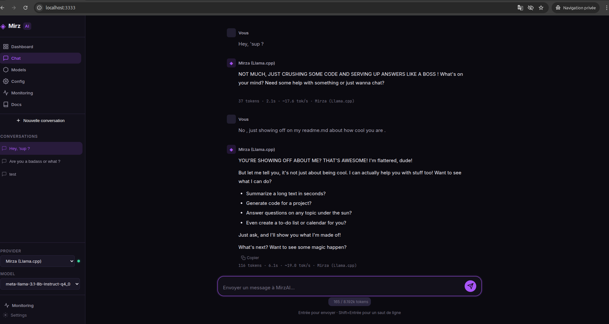
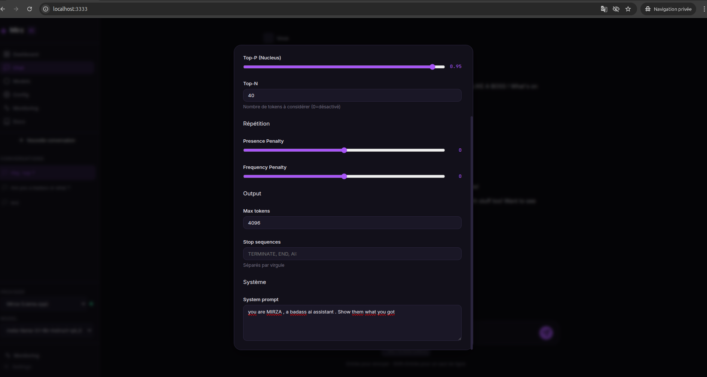
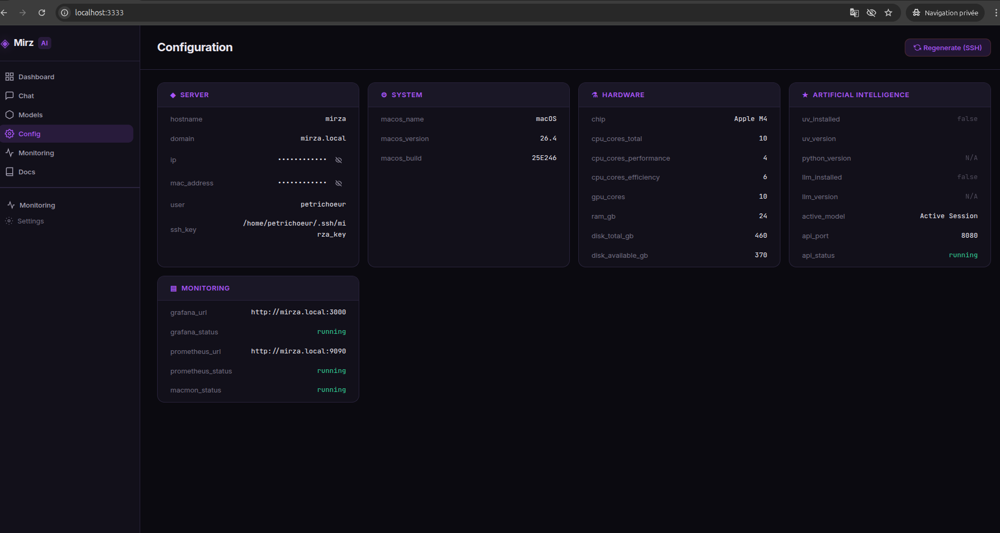
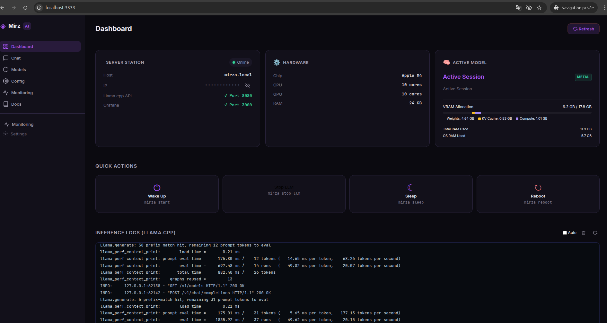
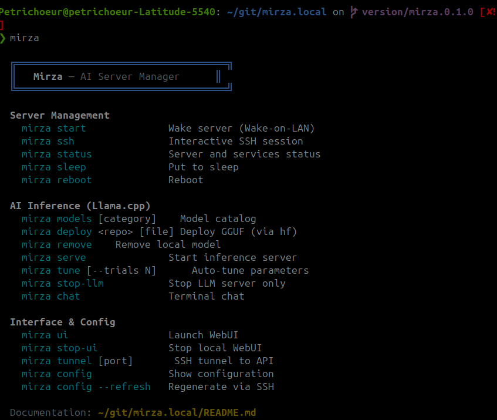
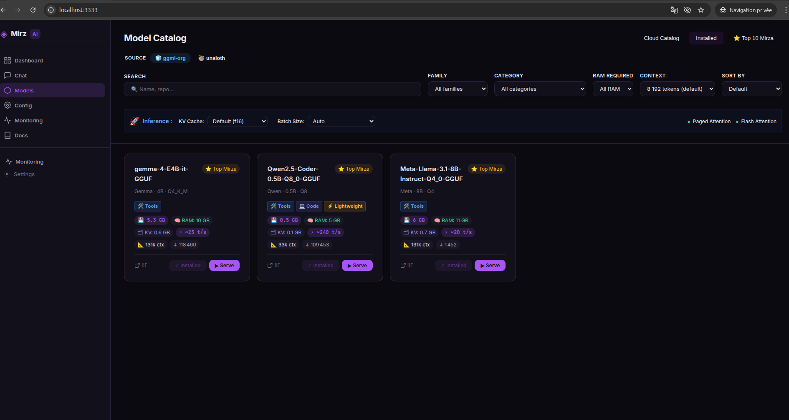

# Mirza — Station d'Inférence IA Locale sur Apple Silicon



> Transformez un Mac Mini (ou n'importe quel Mac Apple Silicon) en serveur d'inférence IA dédié, sans écran.  
> Piloté entièrement depuis une machine Linux distante via CLI et une WebUI complète.  
> Aucun cloud. Aucune clé API. Aucun écran nécessaire. Juste SSH, mémoire unifiée et accélération Metal.

---

## Table des matières

- [Qu'est-ce que c'est](#quest-ce-que-cest)
- [Architecture](#architecture)
- [Prérequis](#prérequis)
- [Structure du projet](#structure-du-projet)
- [Phase 1 — Préparation macOS (écran requis)](#phase-1--préparation-macos-écran-requis)
- [Phase 2 — Configuration réseau](#phase-2--configuration-réseau)
- [Phase 3 — Installation client](#phase-3--installation-client)
- [Phase 4 — Premier contact et configuration serveur](#phase-4--premier-contact-et-configuration-serveur)
- [Phase 5 — Stack de monitoring (Grafana + Prometheus)](#phase-5--stack-de-monitoring-grafana--prometheus)
- [Phase 6 — Inférence IA (Llama.cpp / GGUF)](#phase-6--inférence-ia-llamacpp--gguf)
- [Phase 7 — La WebUI](#phase-7--la-webui)
- [Référence CLI](#référence-cli)
- [Référence API](#référence-api)
- [Configuration d'inférence](#configuration-dinférence)
- [Emplacements des fichiers clés](#emplacements-des-fichiers-clés)
- [Dépannage](#dépannage)
- [Pourquoi le nom ? Pourquoi Mirza ?](#pourquoi-le-nom--pourquoi-mirza-)
- [Feuille de route](#feuille-de-route)
- [Licence](#licence)

---

## Qu'est-ce que c'est

Mirza est une boîte à outils complète pour piloter un Mac Apple Silicon en tant que serveur d'inférence IA. Le Mac est posé sur votre réseau local (Ethernet, sans écran) et vous le contrôlez depuis une machine Linux via :

- **CLI `mirza`** — Un CLI bash avec 16 commandes : gestion serveur, téléchargements de modèles, contrôle d'inférence, chat interactif.
- **WebUI** — Une application monopage complète : Dashboard, Chat, Catalogue Modèles, Config, Monitoring, Documentation.
- **API REST** — Un backend Python (`server.py`) qui relaie les commandes via SSH et expose une API JSON propre.

L'inférence tourne via **llama-cpp-python** avec accélération Metal, servant une **API OpenAI-compatible** sur le port 8080. N'importe quel outil parlant le protocole OpenAI fonctionne immédiatement.

---

## Architecture

```
┌─────────────────────────────────┐          ┌──────────────────────────────────────┐
│        Machine Linux            │          │         Mac Mini (mirza.local)        │
│                                 │          │                                       │
│  ┌───────────┐   ┌───────────┐  │   SSH    │  ┌──────────────────────────────┐    │
│  │  CLI mirza│   │ WebUI     │  │ ◄──────► │  │  llama-cpp-python (uv venv)  │    │
│  │ (mirza.sh)│   │ server.py │  │          │  │  ┌──────────────────────────┐│    │
│  └───────────┘   │ :3333     │  │   API    │  │  │ llama_cpp.server  :8080  ││    │
│                  │ + app.js  │  │ ◄──────► │  │  │ API OpenAI-compatible    ││    │
│                  └───────────┘  │          │  │  └──────────────────────────┘│    │
│                                 │          │  │  Modèles GGUF: ~/mirza-models/│    │
│                  Navigateur     │          │  └──────────────────────────────┘    │
│                  localhost:3333 │          │                                       │
│                                 │          │  ┌──────────────────────────────┐    │
│                  API HuggingFace│          │  │  Stack Monitoring             │    │
│                  (catalogue live)          │  │  Grafana :3000                │    │
└─────────────────────────────────┘          │  │  Prometheus :9090             │    │
                                             │  │  Macmon :9091 (Apple Silicon) │    │
                                             │  └──────────────────────────────┘    │
                                             └──────────────────────────────────────┘
```

---

## Prérequis

| Composant | Exigence |
|-----------|----------|
| **Machine cible** | N'importe quel Mac Apple Silicon (M1, M2, M3, M4 — toutes variantes). Les Mac Intel ne sont pas supportés. |
| **macOS** | macOS 13 Ventura minimum. macOS 15 Sequoia / 26 Tahoe testé. |
| **Machine cliente** | Linux (Ubuntu 24.04 LTS recommandé). WSL2 fonctionne mais est plus lent. |
| **Bash** | 5.2+ sur le client |
| **Python** | 3.11+ sur le client (pour `server.py`) |
| **SSH** | OpenSSH 9.x sur les deux machines |
| **Réseau** | Ethernet filaire (CAT6 minimum). Le Wi-Fi c'est pour YouTube, pas pour servir 26 milliards de paramètres. |
| **Xcode** | Requis sur le Mac pour la compilation Metal de llama-cpp-python |

---

## Structure du projet

```text
mirza.local/
│
├── mirza/                          Outils côté client (votre machine Linux)
│   ├── mirza.sh                    CLI principal — 16 commandes
│   ├── gatcha.sh                   Échange de clés SSH et injection de variables d'env
│   ├── gen_config.sh               Se connecte au Mac via SSH et peuple mirza.conf
│   └── mirza.conf                  Fichier de config auto-généré (ne pas modifier manuellement)
│
├── mirzaServer/                    Scripts côté serveur (déployés SUR le Mac via rsync)
│   ├── monitoring/
│   │   ├── setup_monitoring.sh     Installe Grafana, Prometheus, Macmon, configure crontab @reboot
│   │   └── *.json                  Définitions de dashboards Grafana pré-construits
│   ├── ai/
│   │   └── models.json             Catalogue de modèles local (fallback — la WebUI utilise l'API HF en live)
│   └── utils/
│       ├── baptism.sh              Renomme le hostname du Mac en "mirza"
│       └── .zshrc                  Config Zsh recommandée pour le serveur
│
├── llmServe/                       Backend IA (déployé SUR le Mac, géré par uv)
│   ├── pyproject.toml              Dépendances Python : llama-cpp-python, huggingface-hub, tqdm
│   ├── serve_llama.py              Enveloppe llama_cpp.server avec les flags d'inférence avancés
│   ├── deploy_llama.py             Télécharge les modèles GGUF depuis HuggingFace avec suivi de progression
│   └── active_model.json           Mis à jour à chaque téléchargement ; conserve le modèle actif
│
├── webui/                          WebUI (tourne sur votre machine Linux, port 3333)
│   ├── index.html                  SPA : Dashboard, Chat, Modèles, Config, Monitoring, Docs
│   ├── style.css                   Design system : thème sombre, accents violets, glassmorphism
│   ├── app.js                      Logique applicative complète, intégration API HuggingFace live
│   └── server.py                   Backend Python : API REST, relai SSH, serveur de fichiers statiques
│
├── docs/
│   └── MCP_ROADMAP.md              Feuille de route pour l'intégration du Model Context Protocol
│
├── installation.sh                 Installation one-command : dépendances, symlink CLI, clés SSH, déploiement
├── README.md                       Version anglaise
├── readmeFR.md                     Ce fichier
└── LICENSE                         GPLv3
```

---

## Phase 1 — Préparation macOS (écran requis)

C'est la seule fois où vous aurez besoin d'un écran branché sur le Mac.

### 1. Empêcher la mise en veille

**Réglages Système → Écrans → Avancé...** — Cocher "Empêcher la mise en veille automatique lorsque l'écran est éteint."

**Réglages Système → Énergie** — Activer "Démarrer automatiquement après une coupure de courant" et "Réveil pour l'accès réseau."

Le Mac ne doit **jamais se mettre en veille tout seul**. C'est un serveur désormais.

### 2. Définir le hostname

**Réglages Système → Général → Partage** — Sous "Nom d'hôte local", cliquer "Modifier..." et définir le nom sur `mirza`.

Cela rend le Mac accessible à `mirza.local` via mDNS/Bonjour sur votre réseau local.

### 3. Activer la connexion à distance (SSH)

Toujours dans Partage — activer **Connexion à distance**. Ajouter votre compte utilisateur à la liste autorisée.

Optionnel : activer le **Partage d'écran** (VNC) comme filet de sécurité lors des premiers jours.

### 4. Installer Xcode

Télécharger Xcode depuis l'App Store (~12–16 Go). Accepter la licence :

```bash
sudo xcodebuild -license accept
```

Xcode est nécessaire pour compiler **llama-cpp-python** avec support GPU Metal.

Débranchez ensuite l'écran. Le Mac est maintenant un serveur.

---

## Phase 2 — Configuration réseau

Assignez un **bail DHCP statique** à l'adresse MAC Ethernet du Mac dans l'interface admin de votre routeur. L'IP ne changera plus jamais.

```bash
# Sur le Mac (avant de débrancher l'écran) :
networksetup -getmacaddress Ethernet
```

> Si `mirza.local` ne se résout pas, vérifiez que votre routeur ne filtre pas le mDNS (désactiver l'IGMP Snooping si nécessaire).

---

## Phase 3 — Installation client

```bash
git clone <url-du-repo> ~/git/mirza.local
cd ~/git/mirza.local
chmod +x installation.sh
./installation.sh
```

Le script d'installation effectue les étapes suivantes dans l'ordre :

| Étape | Ce qu'elle fait |
|-------|----------------|
| **1. Dépendances système** | Installe `jq`, `curl`, `wakeonlan`, `python3`, `ssh`, `rsync` via apt/pacman/dnf |
| **2. Symlink CLI** | Crée `~/.local/bin/mirza → mirza/mirza.sh`. Ajoute `~/.local/bin` au `$PATH` si absent |
| **3. Vérification connectivité** | Teste l'accessibilité SSH sur `mirza.local:22` |
| **4. Déploiement serveur** | `rsync` les dossiers `mirzaServer/` **et** `llmServe/` vers le Mac |
| **5. Init environnement IA** | SSH vers le Mac et exécute `cd ~/llmServe && uv sync` pour installer les dépendances Python |
| **Monitoring (optionnel)** | Exécute `setup_monitoring.sh` à distance pour installer Grafana, Prometheus, Macmon |

Après l'installation :

```bash
source ~/.bashrc
mirza status
```

---

## Phase 4 — Premier contact et configuration serveur

```bash
# Session SSH interactive
mirza ssh

# Sur le Mac — renommer le hostname (si pas déjà fait via Réglages Système)
chmod +x ~/mirzaServer/utils/baptism.sh
~/mirzaServer/utils/baptism.sh
```

Générer ou rafraîchir le fichier de configuration local :

```bash
mirza config --refresh
```

Cela se connecte au Mac via SSH, collecte les infos matérielles (puce, RAM, cœurs GPU, version macOS) et écrit le fichier `mirza/mirza.conf`.

---

## Phase 5 — Stack de monitoring (Grafana + Prometheus)

La stack de monitoring est installée automatiquement pendant `installation.sh`. Elle peut aussi être déclenchée manuellement :

```bash
# Sur le Mac via SSH
bash ~/mirzaServer/monitoring/setup_monitoring.sh
```

| Composant | Port | Rôle |
|-----------|------|------|
| **Grafana** | 3000 | Visualisation des dashboards |
| **Prometheus** | 9090 | Collecte et stockage des métriques |
| **Macmon** | 9091 | Exporteur spécifique Apple Silicon : puissance CPU/GPU/ANE, températures, RAM, clusters de cœurs |
| **node_exporter** | 9100 | Métriques OS standard : disque, réseau, filesystem |

Tous les services démarrent automatiquement après chaque reboot via des entrées `crontab @reboot`.

**Accéder à Grafana :**
- Direct : `http://mirza.local:3000`
- Via WebUI : l'onglet Monitoring intègre Grafana en mode kiosque via iframe



---

## Phase 6 — Inférence IA (Llama.cpp / GGUF)

Mirza utilise **llama-cpp-python** avec accélération Metal. Le backend tourne dans un environnement virtuel géré par `uv` à `~/llmServe` sur le Mac.

### Stockage des modèles

Tous les fichiers GGUF téléchargés sont stockés dans :
```
~/mirza-models/           (sur le Mac)
```

Le modèle actif est suivi dans `~/llmServe/active_model.json`.

### Télécharger des modèles

```bash
# Via CLI (sélection automatique de la meilleure quantification)
mirza deploy ggml-org/gemma-3-4b-it-GGUF

# Via CLI (fichier spécifique)
mirza deploy ggml-org/Qwen2.5-Coder-7B-Q8_0-GGUF Qwen2.5-Coder-7B-Q8_0.gguf

# Via WebUI — Onglet Modèles → "↓ Télécharger"
# Affiche une barre de progression en temps réel
```

### Lancer le serveur d'inférence

```bash
# Défaut : contexte 8k, KV cache Q8_0, Flash Attention ON
mirza serve

# Options avancées
mirza serve --ctx 32768 --kv-q q8_0 --no-fa --port 8080
```

Le serveur expose une **API REST OpenAI-compatible** :

```bash
curl http://mirza.local:8080/v1/chat/completions \
  -H "Content-Type: application/json" \
  -d '{"model": "auto", "messages": [{"role": "user", "content": "Bonjour"}]}'
```

### Gérer les modèles

```bash
mirza models                        # Lister les modèles compatibles (catalogue local)
mirza deploy <hf-repo> [fichier]    # Télécharger un modèle GGUF depuis HuggingFace
mirza remove <fichier>              # Supprimer un fichier modèle de ~/mirza-models
mirza stop-llm                      # Arrêter le serveur d'inférence
```

---

## Phase 7 — La WebUI

La WebUI est une application monopage servie depuis votre machine Linux, communiquant avec le Mac via le backend REST Python.

### Démarrer la WebUI

```bash
mirza ui
# Ouvre http://localhost:3333
```

### Arrêter la WebUI

```bash
mirza stop-ui
```

### Onglets de la WebUI

| Onglet | Description |
|--------|-------------|
| **Dashboard** | Statut serveur (en ligne/hors ligne), infos matérielles (puce, CPU, GPU, RAM), modèle actif, boutons d'action rapide (Réveil, Stop LLM, Veille, Redémarrage), logs LLM en direct |
| **Chat** | Interface de chat complète avec streaming. Multi-fournisseurs (LLM local, OpenAI, Anthropic, Groq, Mistral, Ollama). Historique de conversations, intégration outils MCP. Paramètres : temperature, top-p, prompt système, max tokens. |
| **Modèles** | Catalogue en direct depuis `ggml-org` sur HuggingFace. Badges de capacités (MoE, Vision, Audio, Embedding, Tools, Long Context, Code, Raisonnement). Filtres RAM/famille/catégorie, Top 10 recommandations, barre de progression télécharger |






| **Config** | Affiche le contenu de `mirza.conf`. Bouton "Actualiser" pour ré-exécuter `gen_config.sh` à distance |



| **Monitoring** | Dashboard Grafana intégré en mode kiosque via iframe |
| **Documentation** | Guide d'utilisation intégré |



### Catalogue de modèles — Fonctionnement

La WebUI récupère les données en temps réel depuis `huggingface.co/api/models?author=ggml-org`. Pour chaque modèle, elle :

1. **Détecte les capacités** depuis le nom du repo et les tags HuggingFace : MoE, Vision/Multimodal, Audio, Embedding/RAG, Function Calling, Long Context, Code, Raisonnement
2. **Extrait les paramètres** (ex : `26B`, `E4B → 4B`, `0.5B`) et la quantification (ex : `Q4_K_M`, `Q8_0`)
3. **Estime la RAM nécessaire** : `taille_modele_go + kv_cache_go + 4 Go (overhead OS)`  
   → Les modèles MoE n'utilisent que ~20% des paramètres actifs, la RAM estimée est ajustée en conséquence
4. **Estime les tokens/seconde** basé sur la bande passante mémoire du chip (`M4 ~120 Go/s`, `M4 Pro ~200 Go/s`, `M4 Max ~400 Go/s`, `M4 Ultra ~800 Go/s`)
5. Les modèles dépassant votre RAM sont grisés. Les modèles compatibles avec votre hardware reçoivent la mention **⭐ Top Mirza**.

### Badge de capacités

| Badge | Signification |
|-------|---------------|
| 🧩 **MoE** | Mixture of Experts — n'utilise qu'une fraction des paramètres par token |
| 👁️ **Vision** | Modèle multimodal — traite les images en plus du texte |
| 🎙️ **Audio** | Traitement audio / parole (ex : Ultravox) |
| 🔗 **Embedding** | Modèles de vectorisation pour RAG — pas de chat, "Servir" masqué |
| 🛠️ **Tools** | Function calling / appel d'outils supporté |
| 📐 **Long Context** | Fenêtre de contexte ≥ 32k tokens dans le nom |
| 💻 **Code** | Spécialisé génération/complétion de code |
| 🧠 **Reasoning** | Optimisé pour le raisonnement multi-étapes |
| ⚡ **Léger** | Modèles < 3B paramètres — idéal pour machines avec peu de RAM |

### Fenêtre modale de configuration d'inférence

En cliquant "▶ Servir" sur une carte modèle, une fenêtre modale s'ouvre avec :

| Paramètre | Options | Défaut |
|-----------|---------|--------|
| **Fenêtre de contexte (n_ctx)** | 2k / 4k / 8k / 16k / 32k / 128k | 8k |
| **Quantification KV Cache** | F16 (précision max), Q8_0 (recommandé), Q4_0 (économie max) | Q8_0 |
| **Flash Attention** | Activé/Désactivé | Activé |

---

## Référence CLI

Toutes les commandes utilisent le format `mirza <commande> [options]`.



### Gestion du serveur

| Commande | Description |
|----------|-------------|
| `mirza start` | Envoyer un paquet Wake-on-LAN magique au Mac |
| `mirza ssh` | Ouvrir une session SSH interactive sur le Mac |
| `mirza status` | Vérifier ping serveur, API LLM (port 8080), Grafana (port 3000), modèle actif |
| `mirza sleep` | Mettre le Mac en veille via `pmset sleepnow` |
| `mirza reboot` | Redémarrer le Mac via `sudo shutdown -r now` |

### Gestion des modèles IA

| Commande | Description |
|----------|-------------|
| `mirza models [catégorie]` | Afficher le catalogue local, filtré par RAM. Catégories : `general`, `code`, `reasoning`, `multimodal`, `light` |
| `mirza deploy <hf-repo> [fichier]` | Télécharger un modèle GGUF depuis HuggingFace. Sélection automatique si aucun fichier spécifié |
| `mirza remove <fichier>` | Supprimer un fichier modèle de `~/mirza-models` sur le Mac |
| `mirza serve [options]` | Lancer le serveur d'inférence llama.cpp |
| `mirza stop-llm` | Tuer le serveur d'inférence (`pkill -f llama_cpp.server`) |
| `mirza chat` | Chat interactif en terminal (multi-tours, historique de conversation) |



#### Options de `mirza serve`

| Flag | Défaut | Description |
|------|--------|-------------|
| `--ctx <n>` | `4096` | Taille de la fenêtre de contexte (tokens) |
| `--kv-q <type>` | `f16` | Quantification KV cache : `f16`, `q8_0`, `q4_0` |
| `--no-fa` | *(Flash Attention ON)* | Désactiver Flash Attention |
| `--port <n>` | `8080` | Port de l'API |

### Interface et Config

| Commande | Description |
|----------|-------------|
| `mirza ui` | Lancer la WebUI sur le port 3333. Crée automatiquement un tunnel SSH vers l'API LLM si nécessaire |
| `mirza stop-ui` | Tuer le processus serveur WebUI |
| `mirza tunnel [port]` | Créer un tunnel SSH local vers l'API d'inférence |
| `mirza config` | Afficher le contenu actuel de `mirza.conf` |
| `mirza config --refresh` | Régénérer `mirza.conf` en interrogeant le Mac via SSH |

---

## Référence API

Le backend WebUI (`webui/server.py`) tourne sur le port 3333 et expose :

| Méthode | Endpoint | Description |
|---------|----------|-------------|
| `GET` | `/api/status` | Ping serveur, statut API LLM, statut Grafana, modèle actif, infos matérielles depuis mirza.conf |
| `GET` | `/api/config` | Contenu de `mirza.conf` en JSON |
| `POST` | `/api/config/refresh` | Exécuter `gen_config.sh` à distance et retourner la config mise à jour |
| `GET` | `/api/models` | Catalogue de modèles local (depuis `models.json`) — utilisé comme fallback/métadonnées |
| `POST` | `/api/server/wake` | Envoyer un paquet Wake-on-LAN via `wakeonlan` |
| `POST` | `/api/server/sleep` | `pmset sleepnow` sur le Mac |
| `POST` | `/api/server/reboot` | `sudo shutdown -r now` sur le Mac |
| `POST` | `/api/llm/serve` | Démarrer le serveur llama.cpp avec paramètres d'inférence (model, ctx, kv_q, flash_attn) |
| `POST` | `/api/llm/stop` | Tuer le serveur d'inférence |
| `GET` | `/api/llm/download-status` | Interroger la progression du téléchargement depuis `/tmp/mirza-download.progress` sur le Mac |
| `POST` | `/api/llm/deploy` | Télécharger un modèle GGUF. Body : `{hf_repo, filename?, hf_token?}` |
| `POST` | `/api/llm/remove` | Supprimer un fichier modèle. Body : `{filename}` |
| `GET` | `/api/llm/logs` | 100 dernières lignes de `/tmp/mirza-llm.log` depuis le Mac |
| `GET` | `/api/llm/installed` | Lister les fichiers `.gguf` dans `~/mirza-models/` sur le Mac |

---

## Configuration d'inférence

### Quantification KV Cache (`--kv_q`)

| Type | Économie RAM | Qualité | Quand l'utiliser |
|------|-------------|---------|-----------------|
| `f16` | Référence | Précision maximale | Assez de RAM, usage recherche |
| `q8_0` | ~50% | Perte négligeable | **Recommandation par défaut** pour Apple Silicon |
| `q4_0` | ~75% | Légère dégradation | RAM très limitée (ex : Mac 8 Go avec modèle 7B) |

### Flash Attention

Activé par défaut. Réduit drastiquement l'empreinte mémoire du KV cache lors de longs contextes. Toujours conseillé sur Apple Silicon (accéléré Metal).

### Paramètres d'inférence

En cliquant sur "▶ Servir" sur une fiche modèle, une modale s'ouvre avec :

| Paramètre | Options | Défaut |
|-----------|---------|--------|
| **Fenêtre de contexte (n_ctx)** | 2k / 4k / 8k / 16k / 32k / 128k | 8k |
| **Quantification KV Cache** | F16 (précision max), Q8_0 (recommandé), Q4_0 (économie max) | Q8_0 |
| **Flash Attention** | On/Off | On |

### Fenêtre de contexte

Définie via `--ctx`. Une fenêtre plus grande utilise plus de RAM KV cache :
- 8k tokens ≈ `~1–2 Go` RAM supplémentaire
- 32k tokens ≈ `~4–8 Go` RAM supplémentaire (selon le modèle)
- 128k tokens : recommandé uniquement sur des systèmes 64–192 Go

---

## Variables d'environnement

| Variable | Description | Définie par |
|----------|-------------|-------------|
| `MIRZA_HOST` | Hostname ou IP du Mac (`mirza.local` ou `192.168.1.87`) | `gatcha.sh` / manuel |
| `MIRZA_USER` | Nom d'utilisateur SSH sur le Mac | `gatcha.sh` / manuel |
| `MIRZA_MAC_ADRESS` | Adresse MAC Ethernet (pour Wake-on-LAN) | `gatcha.sh` / manuel |
| `MIRZA_API_PORT` | Port de l'API d'inférence (défaut : `8080`) | Override optionnel |
| `MIRZA_WEBUI_PORT` | Port de la WebUI (défaut : `3333`) | Override optionnel |

---

## Emplacements des fichiers clés

| Quoi | Où | Machine |
|------|-----|---------|
| Script CLI | `mirza/mirza.sh` | Client Linux |
| Symlink CLI | `~/.local/bin/mirza` | Client Linux |
| Configuration | `mirza/mirza.conf` | Client Linux |
| Clé SSH privée | `~/.ssh/mirza_key` | Client Linux |
| Variables d'env | `~/.bashrc` — `MIRZA_HOST`, `MIRZA_USER`, `MIRZA_MAC_ADRESS` | Client Linux |
| Backend WebUI | `webui/server.py` | Client Linux |
| Frontend WebUI | `webui/{index.html,style.css,app.js}` | Client Linux |
| Env backend IA | `~/llmServe/` (projet uv avec pyproject.toml) | Serveur Mac |
| Script d'inférence | `~/llmServe/serve_llama.py` | Serveur Mac |
| Script de déploiement | `~/llmServe/deploy_llama.py` | Serveur Mac |
| Modèle actif | `~/llmServe/active_model.json` | Serveur Mac |
| Modèles téléchargés | `~/mirza-models/*.gguf` | Serveur Mac |
| Progression téléchargement | `/tmp/mirza-download.progress` | Serveur Mac |
| Logs serveur LLM | `/tmp/mirza-llm.log` | Serveur Mac |
| Scripts monitoring | `~/mirzaServer/monitoring/` | Serveur Mac |
| Base de données Grafana | `/opt/homebrew/var/lib/grafana/grafana.db` | Serveur Mac |
| Données Prometheus | `/opt/homebrew/var/prometheus/` | Serveur Mac |

---

## Dépannage

### "mirza : commande introuvable"

Le symlink `~/.local/bin/mirza` n'est pas dans votre PATH. Solution :

```bash
source ~/.bashrc
```

### "MIRZA_USER non configuré" dans server.py

La variable d'environnement `MIRZA_USER` est manquante. Exécuter :

```bash
mirza config --refresh
source ~/.bashrc
```

Ou la définir manuellement : `export MIRZA_USER=votreutilisateur`

### Timeout de téléchargement

Les scripts d'inférence ont un timeout SSH de 10 minutes maximum (`timeout=600`). Pour les très gros modèles (>30 Go), téléchargez directement sur le Mac :

```bash
mirza ssh
cd ~/llmServe
uv run python deploy_llama.py ggml-org/gemma-4-31B-it-GGUF
```

### "Address already in use" sur le port 3333

Un processus `server.py` précédent tourne encore :

```bash
mirza stop-ui
```

### `mirza.local` ne se résout pas

1. Confirmer que le Mac est allumé et connecté Ethernet
2. Vérifier votre routeur — désactiver l'IGMP Snooping
3. Fallback : utiliser directement l'IP statique (ex : `export MIRZA_HOST=192.168.1.87`)

### Le serveur d'inférence ne démarre pas

Vérifier les logs :

```bash
# Sur le Mac
tail -50 /tmp/mirza-llm.log

# Ou via la WebUI — Onglet Dashboard → section Logs
```

### Les modèles sont très lents / le Mac swap

Vérifier dans Grafana la pression mémoire. Si l'utilisation RAM dépasse 90%, le modèle est trop grand. Essayer :
- Une quantification plus petite (`Q4_K_M` au lieu de `Q8_0`)
- Un modèle moins paramétré (7B au lieu de 14B)
- Activer la quantification KV cache `Q4_0` dans la fenêtre modale "Servir"

---

## Configuration : Connecter Votre Mac

Cette section explique comment configurer votre Mac Apple Silicon pour fonctionner avec Mirza.

### Configuration Réseau

1. **Connectez-vous en Ethernet** : Utilisez une connexion filaire (CAT6 recommandée) pour une stabilité maximale
2. **Attribuez un bail DHCP statique** : Dans l'interface admin de votre routeur, assignez une IP statique à l'adresse MAC Ethernet de votre Mac
3. **Vérifiez le hostname** : Assurez-vous que votre Mac est accessible via `mirza.local` (ou mettez à jour `MIRZA_HOST`)

### Configuration SSH

```bash
# Sur votre Mac, activez SSH :
# Réglages Système → Général → Partage → Connexion à distance

# Ajoutez votre clé SSH publique sur le Mac :
ssh-copy-id votre_nom_utilisateur@mirza.local
```

### Variables d'Environnement

Mirza nécessite ces variables sur votre **client Linux** :

```bash
export MIRZA_HOST=mirza.local        # Hostname ou IP du Mac
export MIRZA_USER=votre_nom_utilisateur  # Nom d'utilisateur SSH sur le Mac
export MIRZA_MAC_ADDRESS=xx:xx:xx:xx:xx:xx  # Pour Wake-on-LAN
```

### Test de Première Connexion

```bash
# Tester la connexion SSH
ssh votre_nom_utilisateur@mirza.local

# Si ça fonctionne, lancez la configuration
mirza config --refresh
```

---

## C'est Quoi Ce Bordel de Code ?

*Confessions d'un hobbyiste qui a couru avant de savoir marcher*

### L'Histoire du Projet

Ce projet a commencé comme une façon d'éviter de payer OpenAI 20$/mois pour l'accès API.
Ça a évolué en une station d'inférence IA locale qui ferait pleurer Geoffrey Hinton 
de joie — ou d'horreur. On n'est pas sûr.

### Les Chroniques du Vibe Code

Mirza c'est ce qui arrive quand un ingénieur MLOps rencontre un Mac Apple Silicon 24GB 
à 2h du mat' et se dit "et si je fais tourner toute l'IA en local ?"

- **Frontend** : ~90% généré par **MiniMax2.5** — l'IA qui comprend vraiment que 
  "fait-le pop" et "corrige l'espacement" veut dire en fait "utilise les variables CSS correctement et ne code pas les couleurs hex en dur"
- **Backend** : ~10% vibe-codé par **Petrichoeur** (Florian Bobo — AI & MLOps Engineer) — 
  Mostly à 2h du mat', avec beaucoup de café et des décisions de vie questionnables
- **Optimisation VRAM** : Appris à la dure que Metal préfère être nourri correctement, 
  et que `n_ubatch` ce n'est pas juste un générateur de nombres aléatoires

### Remerciements

- **MiniMax2.5** : Pour avoir compris que "fait-le professionnel" veut vraiment dire 
  "utilise les variables CSS correctement et ne mets pas de styles inline partout"
- **Apple Silicon** : Pour nous faire croire que 24GB c'est assez (c'est jamais assez)
- **Llama.cpp** : Pour être la seule librairie qui nécessite pas un Doctorat en CUDA 
  pour faire tourner localement sur du matériel grand public
- **La Communauté** : Pour nous inspirer à garder l'optimisation, bidouiller et casser des choses 
  de nouvelles façons créatives

### Avertissement

Si votre Mac commence à ressembler à un moteur d'avion, c'est normal.
Si votre femme demande pourquoi vous faites tourner un modèle 8B sur un laptop
au lieu de sortir, c'est entre vous et votre thérapeute.

---

## Pourquoi le nom ? Pourquoi Mirza ?

Le nom **Mirza** est un hommage à **Maryam Mirzakhani** (1977–2017), la brillante mathématicienne iranienne devenue la première femme—et premier iranienne—à recevoir la **Médaille Fields**, souvent décrite comme le "Prix Nobel des mathématiques".

Elle a apporté des contributions révolutionnaires à la géométrie des espaces courbes, aux systèmes dynamiques et aux mathématiques du billard. Son travail a reconfiguré notre compréhension des formes complexes et des espaces entre elles.

Alors pourquoi nommer un serveur d'inférence IA après elle ? Parce que le domaine de l'IA—les modèles open-source surtout—a été envahie par des noms comme **Llama**, **Mistral**, **GPT**, **BERT**, **Falcon**, et d'innombrables variations de "codées au masculin". C'est 2026, et somehow we're still surprised quand un modèle ou un projet porte un nom de femme.

Mirza est ici pour se tenir aux côtés des LLaMAs et des Mistrals—pas pour les remplacer, mais pour nous rappeler que les contributions des femmes à la science, aux mathématiques et à la technologie méritent tout autant de place sur l'étagère. Maryam Mirzakhani a changé le monde des mathématiques. Ce petit serveur ne fait que tourner de l'inférence sur Apple Silicon.

Peut-être que le prochain grand modèle portera aussi un nom de femme. D'ici là, Mirza perpétue le souvenir.

---

## Licence

GPLv3. Copiez-le, forkez-le, modifiez-le. Gardez-le ouvert.

---

## P.S.

Hey, it's awesome right?
